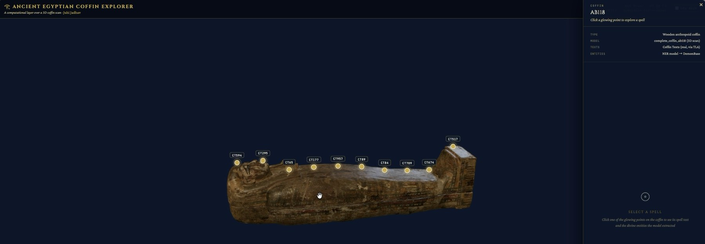

# Ancient Egyptian Coffin Explorer

A computational layer over a 3D coffin scan. Click a marker on the coffin to open the Coffin Texts
spell written there, see the divine and demonic entities a named-entity recognition model extracted
straight from the transliteration, and read each entity's classification from DemonBase.

**[Open the live demo](https://juhij2.github.io/egyptian-coffin-explorer/)**

[](https://juhij2.github.io/egyptian-coffin-explorer/)

---

## Why

Egyptological 3D models and Egyptological databases exist, and both are excellent. What generally does not
exist is an automatic link between them. Annotating a coffin with the entities named in its texts is
normally manual work, one figure at a time.

This is a prototype of that link being made by a model instead: transliteration goes in, tagged entities
come out, and each one is resolved against a demonological database and projected back onto the object
the text was written on.

The wider research problem it points at is the one Kasia Szpakowska founded the DemonThings project to
address: matching unnamed image-entities in vignettes and on coffins to their named textual attestations.

## How it works

```
Coffin Texts passage (Leiden transliteration, via TLA)
        │
        ▼
  BiLSTM-CRF NER model  ──►  entity spans
        │
        ▼
  join on (spell, token)  ──►  DemonBase record
        │
        ▼
  classification: kind · gender · what the name indicates
        │
        ▼
  rendered at a marker on the 3D coffin
```

The NER model is a character-level BiLSTM-CRF trained on TLA transliteration with a single `ENTITY`
class. On a held-out test set it scores **F1 0.938** (precision 0.946, recall 0.930).

## What is on the coffin

Ten spells, thirty-three tagged tokens, ten entities resolved to DemonBase records.

| Marker | Spell | Entity | DemonBase | Classification |
|---|---|---|---|---|
| CT594 | CT VI 213 b–g | *ꜥꜣtt* | #17 "She of the knife (?)" | Individual · Female |
| CT295 | CT IV 048 a | *nfr-tm* | #3350 "Nefertem" | Male |
| CT65 | CT I 278 h – 279 a | *wp-wꜣwt* | #3751 "Wepwawet" | Collective |
| CT177 | CT III 064 d | *wp-wꜣwt* | #3751 "Wepwawet" | Collective |
| CT957 | CT VII 174 h | *ꜥꜣpp* | #264 "Apep" | Individual · Male |
| CT89 | CT II 055 c | *nbḏw* | #1817 "Destroyer" | Individual · Male · Behaviour, chaotic |
| CT84 | CT II 050 h | *jtrty* | #222 "The two Conclaves" | Individual · Male |
| CT709 | CT VI 340 n 2 | *jbṯtyw* | #1429 "Trappers" | Collective · Appearance, equipment |
| CT674 | CT VI 302 j | *ꜣdmw* | #1412 "Ademu" | Individual · Male |
| CT517 | CT VI 107 e | *ḫꜣtyw* | #1434 "Slayers" | Collective · Function, slaughtering |

In the viewer, entities the model tagged are highlighted inline in the transliteration: turquoise where a
DemonBase record was matched, gold dashes where the model tagged something that had no match.

## What this is, and what it is not

This demonstrates a pipeline. It is **not** an edition of this coffin, and two things should be stated
plainly before anyone reads more into it than is there.

**The spells shown are not the texts on this object.** No published transliteration specific to AB118 was
available, so the passages are real Coffin Texts drawn from the Thesaurus Linguae Aegyptiae from other
witnesses. They are genuine texts, correctly cited, but they are not what is written on this coffin.

**The marker positions are illustrative.** They are placed algorithmically along the lid, by raycasting
onto the surface. They are not the epigraphic locations of those spells. A real edition would require
mapping each passage to where it actually appears on the object.

**The tagger over-fires.** CT594 is the clearest case: the model tags thirteen tokens, of which one is a
demon and most of the rest are materials, faience, lapis lazuli, turquoise. A single-class entity model
trained on proper-noun annotation does this, and it is visible in the viewer rather than hidden.

**DemonBase links do not resolve.** DemonBase has no public URL-by-id, so the outbound links are inert.
The classification data is shown inline instead, read from a DemonBase export.

## Run it

The hosted version needs nothing installed:
<https://juhij2.github.io/egyptian-coffin-explorer/>

The coffin model is 66 MB, so give the first load a few seconds before anything appears.

To run it locally instead:

```
git clone https://github.com/Juhij2/egyptian-coffin-explorer.git
cd egyptian-coffin-explorer
python3 -m http.server 8000
```

Then open <http://localhost:8000>. A local server is required, since browsers block loading a `.glb` from
a `file://` page.

## Editing the content

Everything you would change lives in **`annotations.js`**:

- `DEMONBASE_BASE`, the base URL that entity links are appended to
- `HOTSPOTS[]`, one entry per marker: `id`, `title`, `spell` (transliteration), `translation`, `entities[]`

Each entity carries `name`, and where a database match exists, `dbId`, `dbTranslation`, `dbSource`,
`dbKind`, `dbGender` and `dbNameIndicates`.

**Dev mode** (top-left checkbox) prints and copies 3D coordinates when you click the coffin, for placing
markers by hand.

## Files

| | |
|---|---|
| `index.html` | the Three.js viewer |
| `annotations.js` | the data: hotspots, spells, entities |
| `coffin_mr.glb` | the 3D model, 66 MB |
| `screenshot.jpg` | the image above |

## Credits

3D model: **"Complete Coffin (AB118)"** by [The Egypt Centre](https://sketchfab.com/TheEgyptCentre),
Swansea University, obtained from
[Sketchfab](https://sketchfab.com/3d-models/complete-coffin-ab118-0a339e6fe9a547298fa95fb846fa927e)
and licensed [CC-BY-4.0](http://creativecommons.org/licenses/by/4.0/).

**Changes made to the original:** the distributed model used the deprecated
`KHR_materials_pbrSpecularGlossiness` extension, which current Three.js no longer supports. It was
converted to standard `pbrMetallicRoughness` (`coffin_mr.glb`). No geometry was altered.

Coffin Texts passages come from the [Thesaurus Linguae Aegyptiae](https://thesaurus-linguae-aegyptiae.de/).
Entity classification data comes from DemonBase, part of the DemonThings project founded by
Kasia Szpakowska.

The viewer, the hotspot mapping, the NER model and the DemonBase linking are by Juhi Jadhav.
